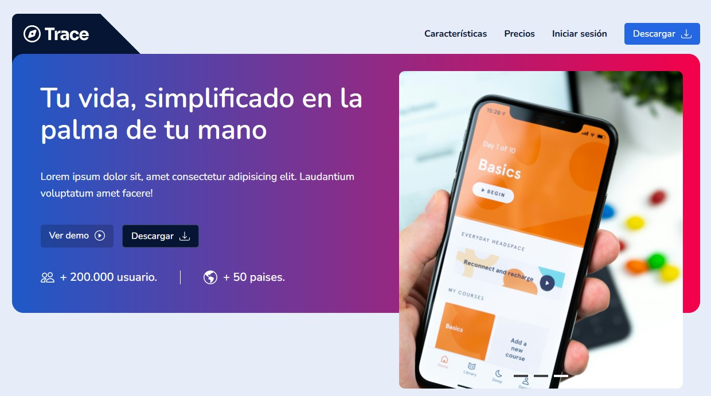

# 🚀 Startup App

## 📌 Descripción

Landing page de una aplicación clara y sencilla con funcionalidades en el slideshow, un carrusel automático que muestra imagenes de la app en el tiempo.

La web esta dividida de manera modular usando **Vite**, permitiendo buena organización y optimización en el producto final.

---

## 🛠️ Tecnologías utilizadas

- **HTML5**
- **CSS3 (Flexbox / Grid / Animaciones)**
- **JavaScript (ES6+)**
- **Vite**

---

## 🎯 Características

- ✅ Interfaz responsive
- ✅ Funcionalidad carrusel, funcionalidad de tabs, transiciones de imagenes en slideshow.

---

## 📸 Capturas de pantalla

---

## 🚀 Demo en vivo

👉 [Ver proyecto en GitHub Pages](https://ivan-develops.github.io/Startup-app/)
